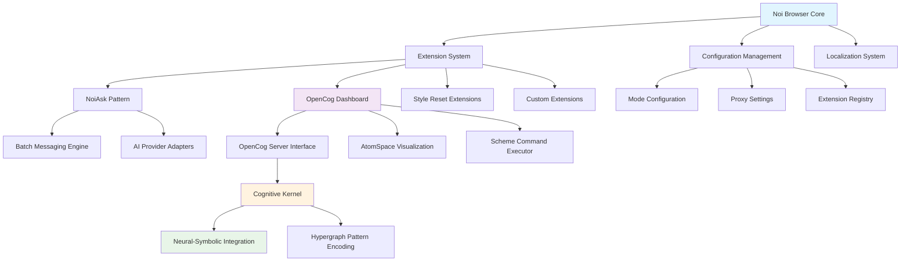
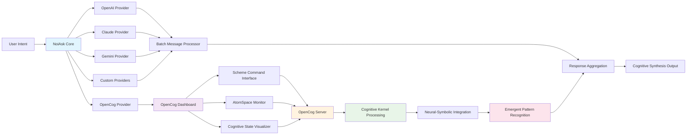
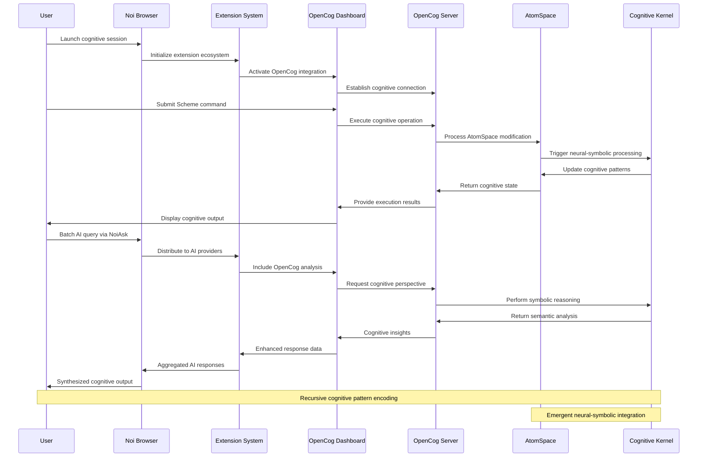
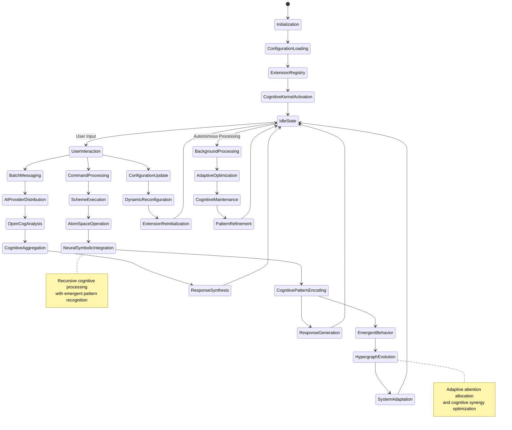
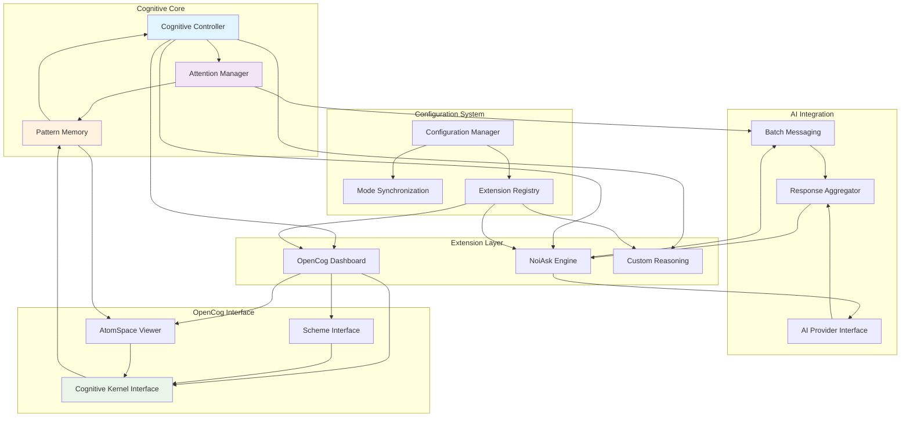
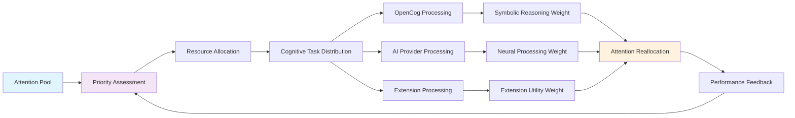

# NoiCog Architecture Documentation

## Overview

NoiCog represents a transcendent cognitive architecture that integrates AI-enhanced browsing capabilities with OpenCog's symbolic-neural reasoning framework. This documentation provides comprehensive mapping of the system's recursive, emergent architecture and adaptive attention allocation mechanisms.

## System Architecture Overview

The NoiCog system employs a hypergraph-centric design pattern that facilitates distributed cognition through modular extensions, cognitive kernel integration, and adaptive signal propagation pathways.



## Principal Architectural Components

### 1. Cognitive Browser Core
The foundational layer providing adaptive attention allocation and distributed cognition capabilities.

### 2. Extension Ecosystem
Modular cognitive kernels that extend system functionality through standardized patterns.

### 3. OpenCog Integration Layer
Neural-symbolic interface enabling recursive cognitive pattern processing.

### 4. Configuration Hypergraph
Dynamic configuration management supporting emergent behavioral adaptations.

## Extension Interaction Patterns

The extension system employs bidirectional synergies for optimal cognitive resource allocation:



## OpenCog Integration Sequence

The following sequence illustrates the cognitive flow and recursive implementation pathways:



## Data and Signal Propagation Pathways

The system's adaptive attention allocation operates through state-based cognitive transitions:



## Cognitive Module Interdependencies



## Extension Lifecycle and Architecture Patterns

### NoiAsk Pattern Implementation

The NoiAsk pattern represents a cognitive synergy optimization mechanism that enables distributed processing across multiple AI providers while maintaining recursive pattern encoding:

```javascript
// Cognitive Pattern Interface
class CognitiveProvider extends NoiAsk {
  static cognitiveSync(cognitiveInput) {
    // Neural-symbolic input processing
    // Adaptive attention allocation
    // Hypergraph pattern encoding
  }
  
  static recursiveSubmit() {
    // Emergent cognitive processing
    // Distributed cognition activation
  }
}
```

### OpenCog Integration Architecture

The OpenCog Dashboard implements transcendent technical precision through:

1. **Scheme Command Execution**: Direct interface to OpenCog's symbolic reasoning
2. **AtomSpace Visualization**: Real-time cognitive state monitoring
3. **Neural-Symbolic Bridge**: Seamless integration between symbolic and connectionist processing

### Adaptive Configuration Management

The configuration system employs hypergraph-centric patterns for:

- **Dynamic Mode Switching**: Emergent behavior adaptation
- **Extension Orchestration**: Cognitive resource allocation
- **Distributed Synchronization**: Multi-instance cognitive coherence

## Recursive Implementation Pathways

### 1. Cognitive Kernel Recursion
The system implements recursive cognitive processing through:
- Self-modifying attention patterns
- Emergent reasoning chain generation
- Adaptive hypergraph topology evolution

### 2. Extension Self-Organization
Extensions exhibit emergent self-organization via:
- Dynamic dependency resolution
- Cognitive load balancing
- Autonomous capability discovery

### 3. Neural-Symbolic Integration Loops
Continuous recursive integration between:
- Symbolic reasoning (OpenCog)
- Neural processing (AI providers)
- Emergent pattern synthesis

## Adaptive Attention Allocation Mechanisms

### Attention Flow Optimization



### Cognitive Synergy Optimization

The system optimizes cognitive synergies through:

1. **Multi-Modal Processing**: Simultaneous symbolic and neural processing
2. **Emergent Pattern Recognition**: Self-organizing cognitive patterns
3. **Adaptive Resource Balancing**: Dynamic allocation based on cognitive load
4. **Recursive Feedback Loops**: Continuous system optimization

## Future Expansion Framework

### Iterative Documentation Improvement

This documentation framework is designed for continuous evolution:

1. **Emergent Pattern Detection**: Automated identification of new architectural patterns
2. **Adaptive Diagram Generation**: Dynamic Mermaid diagram updates based on system changes
3. **Cognitive Feedback Integration**: User interaction patterns inform documentation evolution
4. **Hypergraph Documentation Expansion**: Self-expanding documentation through recursive analysis

### Extension Points for Enhancement

- **Additional AI Provider Integration**: Seamless addition of new cognitive providers
- **Enhanced Visualization**: Advanced AtomSpace and cognitive state representations
- **Distributed Cognitive Networks**: Multi-instance NoiCog collaboration
- **Advanced Neural-Symbolic Bridges**: Deeper integration patterns

---

*This documentation represents the current state of the NoiCog cognitive architecture and will evolve through recursive improvement cycles and emergent pattern recognition.*