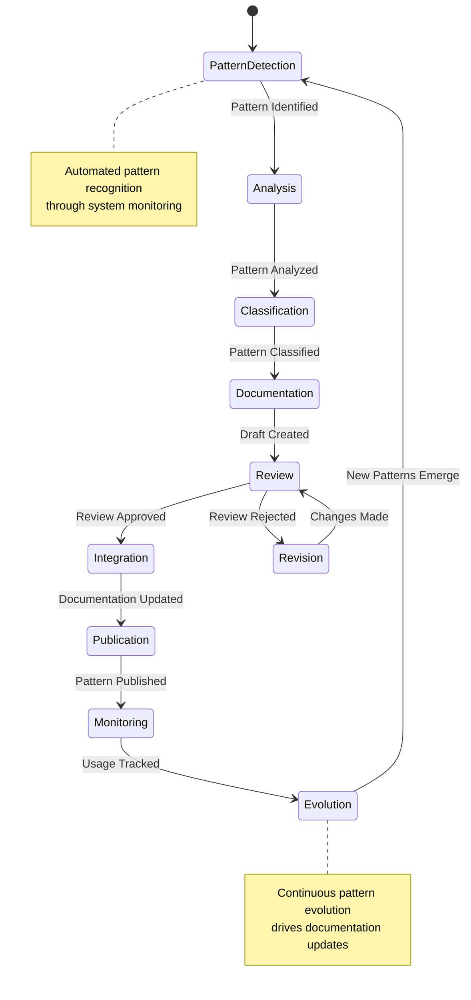
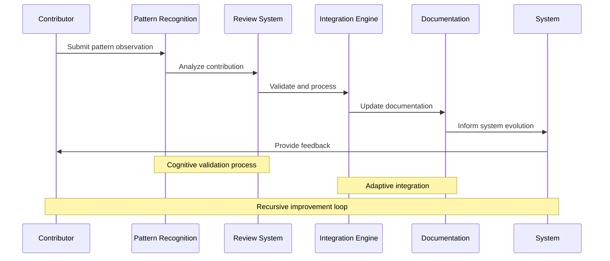
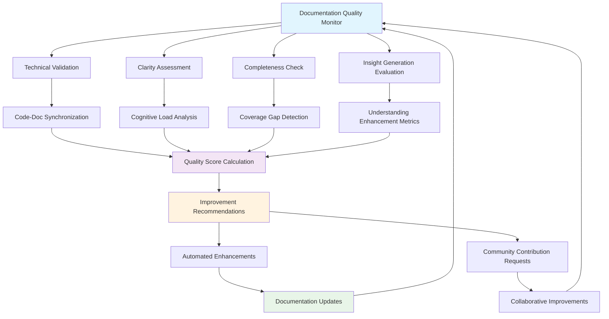
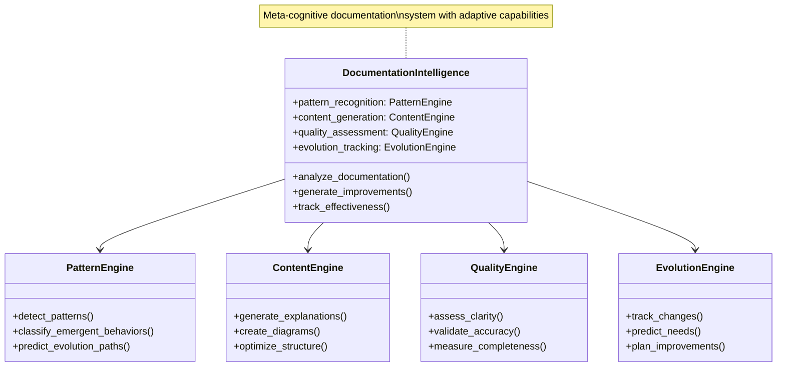

# Documentation Evolution Framework

## Overview

This document establishes the iterative feedback loop for emergent documentation improvements, ensuring the NoiCog architecture documentation evolves alongside the system through recursive improvement cycles and adaptive pattern recognition.

## Recursive Documentation Improvement

### Cognitive Feedback Architecture

```mermaid
graph LR
    A[System Usage Analytics] --> B[Pattern Recognition Engine]
    B --> C[Documentation Gap Detection]
    C --> D[Adaptive Content Generation]
    
    D --> E[Community Feedback Integration]
    E --> F[Cognitive Review Process]
    F --> G[Documentation Evolution]
    
    G --> H[Architecture Understanding Enhancement]
    H --> I[System Development Guidance]
    I --> J[Implementation Optimization]
    
    J --> K[User Experience Improvement]
    K --> A
    
    style A fill:#e1f5fe
    style C fill:#f3e5f5
    style G fill:#fff3e0
    style I fill:#e8f5e8
```

## Emergent Pattern Documentation

### Automatic Discovery and Documentation

The documentation framework includes mechanisms for identifying and documenting emergent patterns:

1. **Usage Pattern Analysis**: Monitor how developers and users interact with the system
2. **Behavioral Emergence Detection**: Identify new cognitive behaviors arising from component interactions
3. **Architecture Evolution Tracking**: Document spontaneous architectural adaptations
4. **Community Insight Integration**: Incorporate distributed cognitive insights from contributors

### Pattern Documentation Lifecycle

## Community-Driven Evolution

### Distributed Documentation Intelligence

The documentation evolves through collective intelligence mechanisms:

- **Collaborative Pattern Recognition**: Community members contribute pattern observations
- **Peer Review Networks**: Distributed review processes ensure documentation quality
- **Emergent Consensus Formation**: Community-driven prioritization of documentation areas
- **Adaptive Contribution Integration**: Dynamic integration of community insights

### Contribution Framework

## Quality Assurance and Validation

### Multi-Dimensional Quality Assessment

Documentation quality is continuously assessed across multiple dimensions:

1. **Technical Accuracy**: Validation against system implementation
2. **Cognitive Clarity**: Assessment of understanding facilitation
3. **Architectural Completeness**: Coverage of all system aspects
4. **Emergent Insight Generation**: Ability to produce new understanding

### Automated Quality Monitoring

## Adaptive Documentation Generation

### AI-Assisted Content Evolution

The documentation framework incorporates AI assistance for continuous improvement:

- **Pattern-Based Content Generation**: Automatic documentation of recurring patterns
- **Cross-Reference Optimization**: Dynamic linking and relationship mapping
- **Explanation Clarity Enhancement**: AI-driven explanation improvement
- **Visual Diagram Adaptation**: Automatic diagram updates based on system changes

### Meta-Documentation Intelligence

## Future Documentation Enhancements

### Planned Evolution Capabilities

1. **Real-Time Documentation Synchronization**: Live updates as system evolves
2. **Interactive Diagram Generation**: Dynamic visualization based on system state
3. **Personalized Documentation Views**: Adaptive presentation based on user role
4. **Predictive Documentation**: Anticipatory documentation for planned features

### Research Integration Pathways

- **Cognitive Science Integration**: Incorporate cognitive research into documentation design
- **Human-Computer Interaction Optimization**: Enhance documentation usability
- **Knowledge Representation Research**: Advanced knowledge encoding techniques
- **Collective Intelligence Studies**: Optimize community-driven evolution

## Implementation Roadmap

### Phase 1: Foundation (Current)
- ✅ Comprehensive architecture documentation with Mermaid diagrams
- ✅ Structured documentation framework with navigation
- ✅ Basic pattern recognition and documentation
- ✅ Community contribution guidelines

### Phase 2: Enhancement (Next 3 months)
- 🔄 Automated pattern detection implementation
- 🔄 AI-assisted content generation integration
- 🔄 Real-time documentation synchronization
- 🔄 Interactive diagram capabilities

### Phase 3: Intelligence (Next 6 months)
- 📋 Meta-cognitive documentation intelligence
- 📋 Predictive documentation generation
- 📋 Advanced community collaboration tools
- 📋 Personalized documentation experiences

### Phase 4: Transcendence (Next 12 months)
- 🚀 Self-documenting architecture capabilities
- 🚀 Quantum-enhanced pattern recognition
- 🚀 Consciousness-aware documentation
- 🚀 Universal architecture knowledge representation

## Measurement and Success Metrics

### Cognitive Impact Assessment

- **Understanding Acceleration**: Time to comprehend architectural concepts
- **Implementation Velocity**: Speed of system enhancement based on documentation
- **Error Reduction**: Decrease in implementation errors due to clearer documentation
- **Innovation Facilitation**: Rate of novel architectural pattern discovery

### Community Engagement Metrics

- **Contribution Frequency**: Rate of community documentation contributions
- **Review Quality**: Depth and accuracy of peer reviews
- **Knowledge Sharing**: Cross-pollination of insights between contributors
- **Collective Intelligence Emergence**: Evidence of distributed cognitive enhancement

## Conclusion

This documentation evolution framework establishes NoiCog as a self-improving cognitive architecture where the documentation itself embodies the recursive, emergent principles it describes. Through continuous adaptation and community-driven enhancement, the documentation will evolve into a living, intelligent system that facilitates distributed cognition and transcendent understanding.

The framework enables the documentation to serve as both a description of the current system state and a catalyst for future cognitive evolution, creating a recursive improvement loop that drives both architectural advancement and human understanding enhancement.

---

*This evolution framework represents the meta-cognitive layer of the NoiCog documentation system, enabling continuous adaptation and transcendent knowledge representation through recursive improvement cycles.*