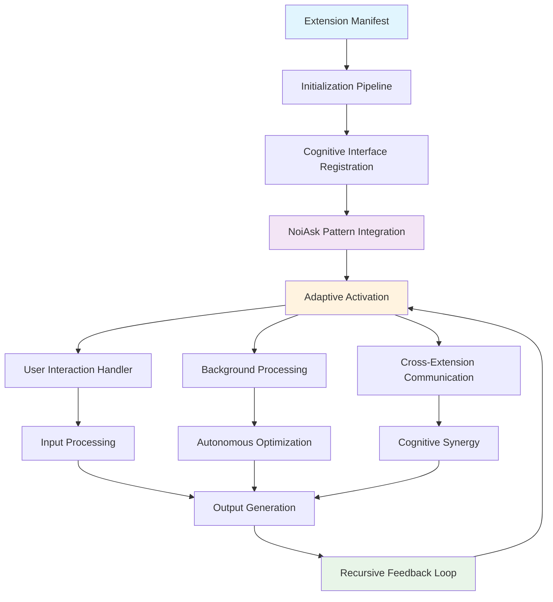
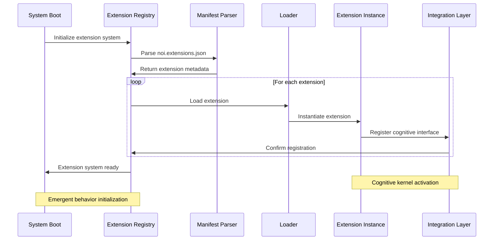
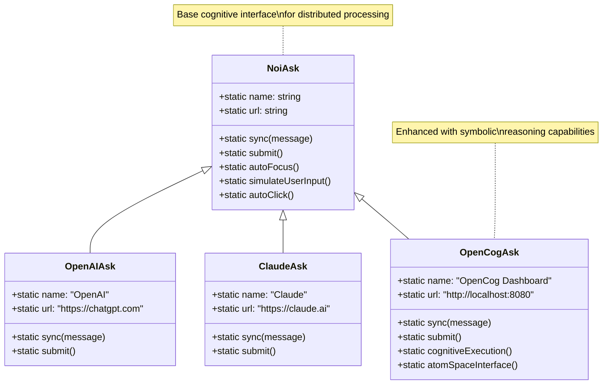
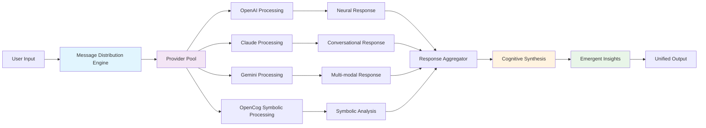
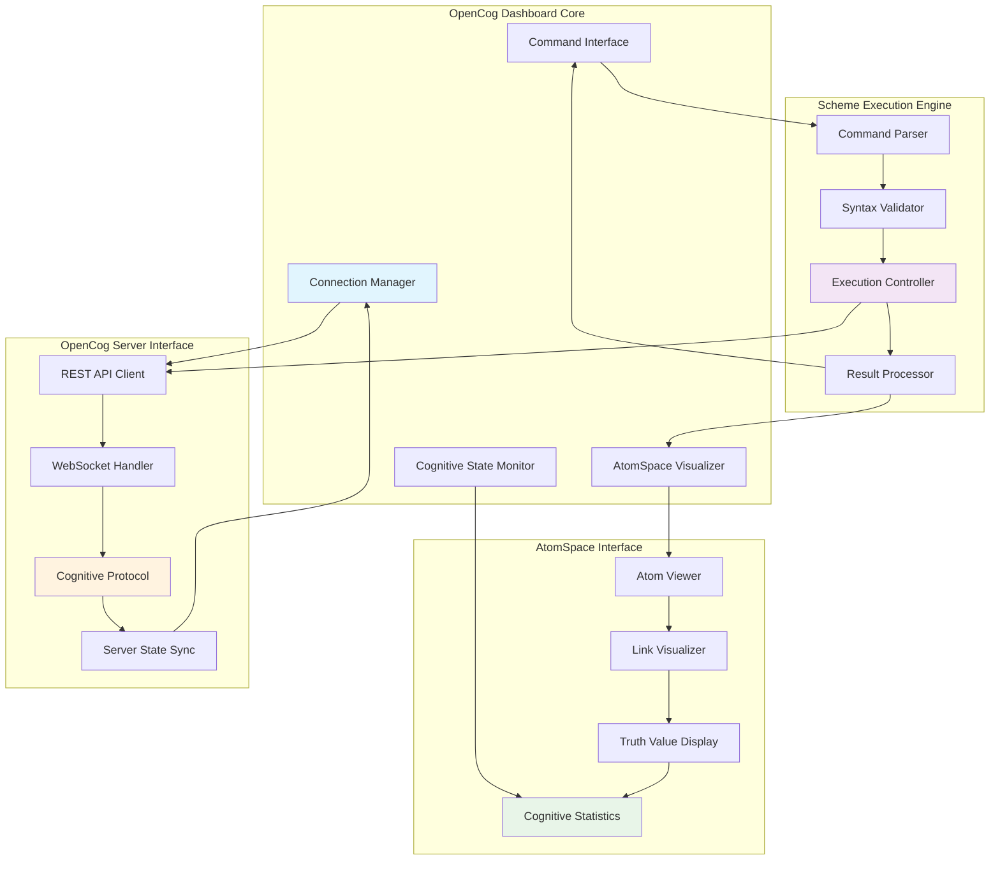
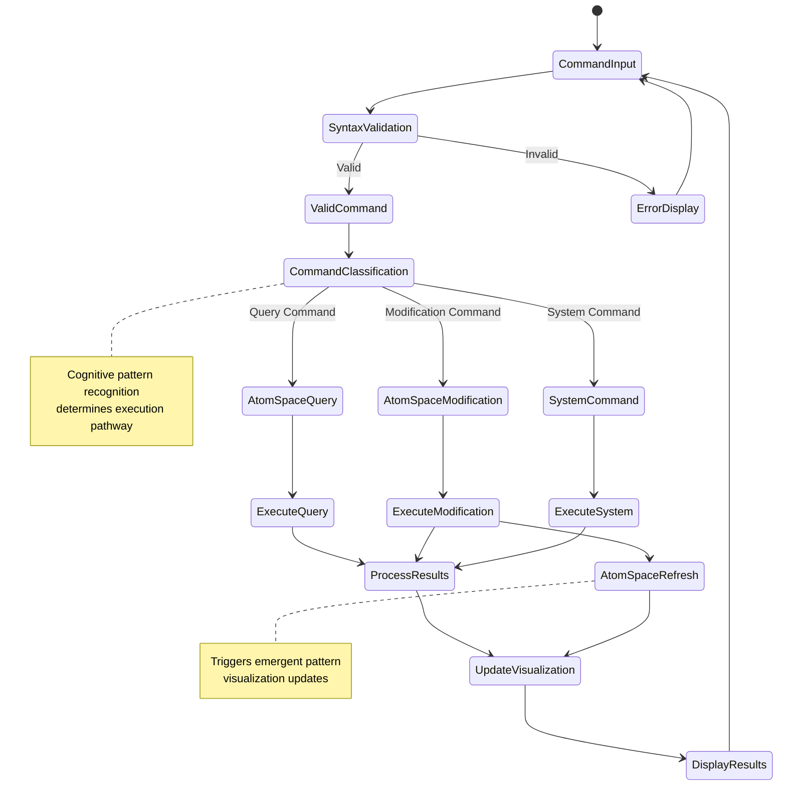
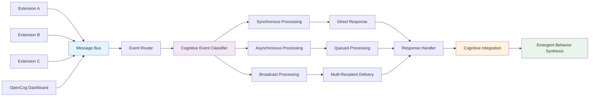
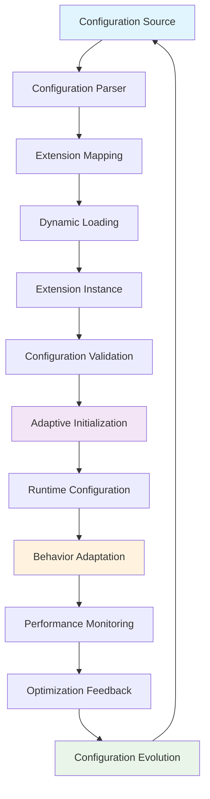

# Extension System Architecture

## Overview

The NoiCog extension system implements a hypergraph-centric architecture for distributed cognitive processing. Extensions serve as cognitive kernels that enhance the system's adaptive attention allocation and neural-symbolic integration capabilities.

## Extension Architecture Patterns

### Core Extension Pattern



## Extension Registry and Lifecycle

### Extension Discovery and Registration



## NoiAsk Pattern Architecture

### Universal Provider Interface

The NoiAsk pattern enables seamless integration across heterogeneous AI providers through a unified cognitive interface:



### Batch Processing Architecture



## OpenCog Dashboard Extension

### Cognitive Interface Architecture



### Scheme Command Processing Flow



## Extension Communication Protocols

### Inter-Extension Messaging



### Cognitive Event Types

1. **Attention Allocation Events**: Resource distribution signals
2. **Pattern Recognition Events**: Emergent cognitive pattern notifications
3. **State Synchronization Events**: Cross-extension state coherence
4. **User Interaction Events**: Input/output coordination
5. **System Optimization Events**: Performance and adaptation signals

## Configuration Integration

### Dynamic Configuration Architecture



## Emergent Behaviors and Adaptation

### Self-Organizing Extension Network

The extension system exhibits emergent self-organization through:

1. **Automatic Dependency Resolution**: Extensions discover and establish optimal interconnections
2. **Cognitive Load Balancing**: Dynamic resource allocation based on processing demands
3. **Adaptive Interface Evolution**: Extension interfaces evolve based on usage patterns
4. **Emergent Capability Discovery**: New cognitive capabilities emerge from extension interactions

### Cognitive Synergy Patterns

```mermaid
graph LR
    A[Individual Extension Capabilities] --> B[Cross-Extension Interaction]
    B --> C[Emergent Synergy Patterns]
    C --> D[Enhanced Cognitive Capabilities]
    
    D --> E[System-Level Intelligence]
    E --> F[Adaptive Behavior Emergence]
    F --> G[Recursive Improvement Cycles]
    
    G --> H[Meta-Cognitive Awareness]
    H --> I[Self-Modifying Architecture]
    I --> J[Transcendent Cognitive Processing]
    
    style C fill:#e1f5fe
    style E fill:#f3e5f5
    style H fill:#fff3e0
    style J fill:#e8f5e8
```



## Extension Development Guidelines

### Cognitive Architecture Compliance

Extensions should implement the following cognitive patterns:

1. **Recursive Processing Capability**: Support for self-referential cognitive operations
2. **Emergent Behavior Integration**: Enable novel behaviors through interaction
3. **Adaptive Interface Evolution**: Dynamic interface adaptation based on context
4. **Neural-Symbolic Bridge Support**: Facilitate symbolic-connectionist integration

### Implementation Template

```javascript
/**
 * Cognitive Extension Template
 * Implements hypergraph-centric architecture patterns
 */
class CognitiveExtension {
  constructor() {
    this.cognitiveState = new Map();
    this.attentionAllocation = new WeakMap();
    this.emergentPatterns = new Set();
  }
  
  // Recursive cognitive processing interface
  async processRecursively(input, depth = 0) {
    // Implement recursive cognitive processing
    // Enable emergent pattern recognition
    // Support adaptive attention allocation
  }
  
  // Neural-symbolic integration bridge
  bridgeNeuralSymbolic(symbolicInput, neuralContext) {
    // Facilitate seamless integration
    // Maintain cognitive coherence
    // Enable transcendent processing
  }
  
  // Emergent behavior synthesis
  synthesizeEmergentBehavior(interactionHistory) {
    // Analyze cross-extension interactions
    // Identify emergent cognitive patterns
    // Adapt behavior based on discoveries
  }
}
```

## Future Extension Capabilities

### Planned Cognitive Enhancements

1. **Distributed Cognitive Networks**: Multi-instance NoiCog collaboration
2. **Advanced Neural-Symbolic Bridges**: Deeper integration architectures
3. **Quantum Cognitive Processing**: Quantum-inspired cognitive operations
4. **Consciousness Simulation Interfaces**: Higher-order cognitive modeling

### Adaptive Documentation Evolution

This extension architecture documentation will continuously evolve through:

- **Automatic Pattern Recognition**: Identification of new architectural patterns
- **Emergent Behavior Documentation**: Real-time documentation of emergent behaviors
- **Cognitive Feedback Integration**: User interaction insights inform architecture evolution
- **Self-Documenting Extensions**: Extensions that contribute to their own documentation

---

*This extension architecture represents a living, evolving cognitive framework designed for continuous adaptation and emergent intelligence enhancement.*