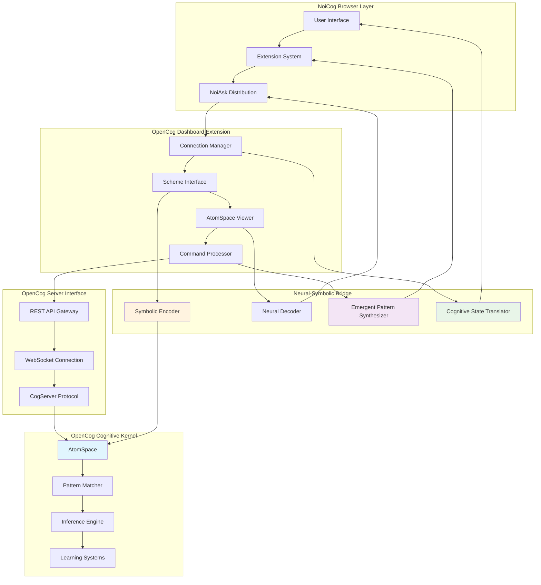

# OpenCog Integration Architecture

## Overview

The OpenCog integration in NoiCog represents a transcendent neural-symbolic bridge that enables recursive cognitive processing through direct AtomSpace manipulation and emergent pattern recognition. This documentation details the hypergraph-centric implementation pathways and adaptive attention allocation mechanisms.

## Neural-Symbolic Integration Architecture

### Core Integration Framework

## AtomSpace Interaction Patterns

### Cognitive Atom Manipulation

### AtomSpace Visualization Architecture

## Scheme Command Processing

### Command Classification and Execution

## Cognitive State Management

### AtomSpace Monitoring and Adaptation

## Recursive Cognitive Processing

### Self-Modifying Attention Patterns

The OpenCog integration implements recursive cognitive processing through self-modifying attention patterns that enable emergent reasoning capabilities:

### Emergent Reasoning Chain Generation

## Hypergraph Pattern Encoding

### Cognitive Pattern Representation

## OpenCog Dashboard Implementation Details

### Connection Management Architecture

### Real-time AtomSpace Synchronization

## Integration with NoiAsk Ecosystem

### Cognitive Provider Enhancement

The OpenCog integration enhances the NoiAsk ecosystem by providing symbolic reasoning capabilities alongside neural AI providers:

## Adaptive Cognitive Optimization

### Performance-Based Evolution

The OpenCog integration continuously evolves its processing patterns based on performance feedback:

1. **Query Pattern Recognition**: Identifies common cognitive query patterns
2. **Response Quality Assessment**: Evaluates the quality of symbolic reasoning outputs
3. **Attention Allocation Optimization**: Adapts attention mechanisms for improved performance
4. **Hypergraph Structure Evolution**: Evolves AtomSpace topology for enhanced processing

### Emergent Capability Discovery

## Future OpenCog Integration Enhancements

### Planned Developments

1. **Advanced Hypergraph Visualization**: Enhanced AtomSpace topology visualization
2. **Distributed Cognitive Networks**: Multi-OpenCog instance collaboration
3. **Quantum-Inspired Cognitive Processing**: Quantum pattern matching algorithms
4. **Consciousness Modeling Interface**: Higher-order cognitive state representation

### Research Integration Pathways

- **Artificial General Intelligence (AGI) Development**: Direct AGI research integration
- **Cognitive Architecture Research**: Advanced cognitive modeling capabilities
- **Neural-Symbolic Learning**: Deep integration between neural and symbolic systems
- **Emergent Intelligence Study**: Investigation of emergent cognitive phenomena

---

*The OpenCog integration represents a foundational step toward achieving artificial general intelligence through recursive cognitive processing and emergent pattern recognition. This documentation will evolve alongside the system's growing cognitive capabilities.*