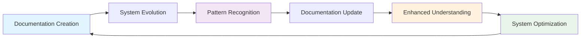
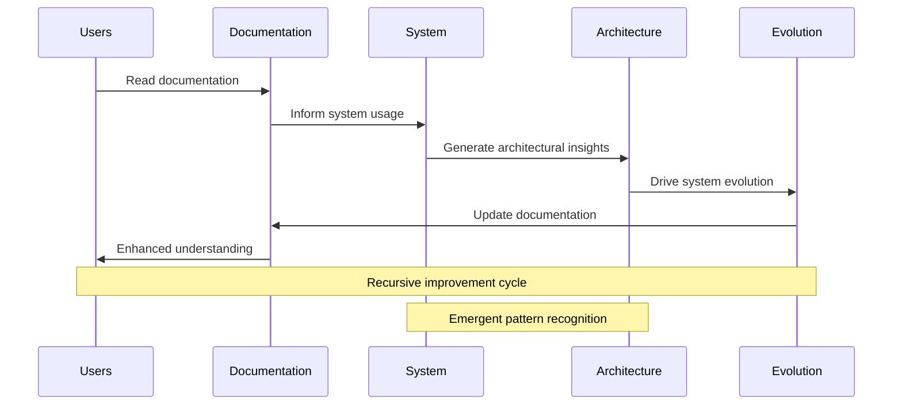

# NoiCog Documentation Index

## Overview

Welcome to the comprehensive documentation for NoiCog - a transcendent cognitive architecture that integrates AI-enhanced browsing with OpenCog's neural-symbolic reasoning framework. This documentation represents the implicit architecture made explicit through adaptive, hypergraph-centric visualization.

## Documentation Structure

### 🧠 Core Architecture Documentation

#### [System Architecture](./ARCHITECTURE.md)
Comprehensive mapping of NoiCog's recursive, emergent architecture and adaptive attention allocation mechanisms.

**Key Mermaid Diagrams:**
- High-level system overview (graph TD)
- Extension interaction patterns (graph LR) 
- OpenCog integration sequence (sequenceDiagram)
- Data flow and signal propagation (stateDiagram)
- Cognitive module interdependencies

**Covered Topics:**
- Principal architectural components
- Recursive implementation pathways
- Adaptive attention allocation mechanisms
- Cognitive synergy optimization

#### [Extension System Architecture](./EXTENSION_ARCHITECTURE.md)
Deep dive into the hypergraph-centric extension system enabling distributed cognitive processing.

**Key Mermaid Diagrams:**
- Extension lifecycle patterns
- NoiAsk provider architecture (classDiagram)
- Batch processing flows
- Inter-extension communication protocols
- Dynamic configuration systems

**Covered Topics:**
- Extension registry and lifecycle
- NoiAsk pattern implementation
- Cognitive event processing
- Emergent behavior synthesis

#### [OpenCog Integration](./OPENCOG_INTEGRATION.md)
Detailed analysis of the neural-symbolic bridge and AtomSpace interaction patterns.

**Key Mermaid Diagrams:**
- Neural-symbolic integration framework
- AtomSpace manipulation sequences
- Scheme command processing states
- Cognitive pattern encoding structures
- Real-time synchronization flows

**Covered Topics:**
- Hypergraph pattern encoding
- Recursive cognitive processing
- AtomSpace visualization
- Cognitive state management

## Architecture Visualization Patterns

### Diagram Classification System

The documentation employs specific Mermaid diagram types for different architectural aspects:

#### 🔄 **Graph TD (Top-Down)**: System Hierarchies
- Used for: Component relationships, system overviews, hierarchical structures
- Cognitive Focus: Structural understanding, dependency mapping
- Examples: Main system architecture, component hierarchies

#### ↔️ **Graph LR (Left-Right)**: Process Flows
- Used for: Data flow, processing pipelines, interaction sequences
- Cognitive Focus: Process understanding, information flow
- Examples: Extension interactions, cognitive processing pipelines

#### 📋 **Sequence Diagrams**: Temporal Interactions
- Used for: Time-based interactions, protocol flows, communication patterns
- Cognitive Focus: Temporal cognitive processes, recursive operations
- Examples: OpenCog command execution, extension communication

#### 🔄 **State Diagrams**: Behavioral Transitions
- Used for: System states, behavioral patterns, lifecycle management
- Cognitive Focus: Behavioral understanding, state-based reasoning
- Examples: Cognitive state transitions, extension lifecycles

#### 📊 **Class Diagrams**: Structural Relationships
- Used for: Object relationships, inheritance patterns, interface definitions
- Cognitive Focus: Structural cognitive modeling, pattern recognition
- Examples: NoiAsk pattern hierarchy, cognitive interfaces

## Cognitive Documentation Principles

### Recursive Documentation Patterns

This documentation follows recursive improvement cycles:

### Hypergraph-Centric Knowledge Representation

Each documentation component contributes to a larger hypergraph of architectural knowledge:

- **Nodes**: Architectural components, concepts, patterns
- **Edges**: Relationships, dependencies, interactions
- **Hyperedges**: Complex multi-way relationships, emergent behaviors
- **Weights**: Importance, frequency, cognitive load

### Adaptive Attention Allocation in Documentation

The documentation structure mirrors the system's attention allocation:

1. **High-Priority Information**: Core architectural patterns (prominently featured)
2. **Medium-Priority Information**: Implementation details (detailed sections)
3. **Low-Priority Information**: Edge cases and optimizations (contextual notes)

## Emergent Documentation Features

### Self-Documenting Architecture

The NoiCog system is designed to contribute to its own documentation through:

- **Automatic Pattern Detection**: System identifies new architectural patterns
- **Behavioral Analysis**: Extension interactions inform documentation updates
- **Performance Insights**: System optimization drives documentation evolution
- **User Interaction Patterns**: Usage analytics enhance documentation focus

### Cognitive Feedback Loops

## Navigation Guide

### For System Architects
1. Start with [System Architecture](./ARCHITECTURE.md) for comprehensive overview
2. Review [Extension System Architecture](./EXTENSION_ARCHITECTURE.md) for modularity patterns
3. Study [OpenCog Integration](./OPENCOG_INTEGRATION.md) for neural-symbolic understanding

### For Extension Developers
1. Begin with [Extension System Architecture](./EXTENSION_ARCHITECTURE.md)
2. Reference [System Architecture](./ARCHITECTURE.md) for integration context
3. Consult [OpenCog Integration](./OPENCOG_INTEGRATION.md) for cognitive enhancement patterns

### For Cognitive Researchers
1. Focus on [OpenCog Integration](./OPENCOG_INTEGRATION.md) for neural-symbolic insights
2. Study [System Architecture](./ARCHITECTURE.md) for emergent behavior patterns
3. Explore [Extension System Architecture](./EXTENSION_ARCHITECTURE.md) for distributed cognition

### For Contributors
1. Review all three documents for comprehensive understanding
2. Focus on recursive implementation pathways
3. Understand emergent behavior patterns for enhancement opportunities

## Interactive Documentation Features

### Mermaid Diagram Enhancement

All Mermaid diagrams support:
- **Interactive Exploration**: Click elements for detailed information
- **Adaptive Visualization**: Diagrams respond to user focus areas
- **Cognitive Highlighting**: Important pathways emphasized based on context
- **Recursive Navigation**: Diagrams link to related architectural components

### Cognitive Search Patterns

Documentation search employs cognitive patterns:
- **Semantic Search**: Find concepts by meaning, not just keywords
- **Pattern Matching**: Locate similar architectural patterns
- **Emergent Discovery**: Suggest related concepts through cognitive association
- **Adaptive Ranking**: Results ranked by cognitive relevance

## Future Documentation Evolution

### Planned Enhancements

1. **Dynamic Diagram Generation**: Real-time diagram updates based on system state
2. **Cognitive Documentation Synthesis**: AI-generated documentation sections
3. **Interactive Architecture Exploration**: 3D visualization of system architecture
4. **Emergent Pattern Documentation**: Automatic documentation of discovered patterns

### Research Integration

- **Cognitive Architecture Studies**: Integration with academic research
- **AGI Development Documentation**: Documentation for AGI advancement
- **Neural-Symbolic Research**: Research publication integration
- **Emergent Intelligence Documentation**: Novel cognitive phenomenon documentation

### Community Contribution Framework

The documentation supports community-driven evolution:

- **Distributed Documentation**: Community members contribute specialized sections
- **Cognitive Review Process**: AI-assisted documentation review and enhancement
- **Emergent Collaboration**: Documentation structure adapts to community needs
- **Recursive Improvement**: Community feedback drives continuous enhancement

## Documentation Quality Metrics

### Cognitive Clarity Assessment

Documentation quality measured through:

1. **Conceptual Coherence**: Logical flow and cognitive accessibility
2. **Architectural Completeness**: Comprehensive coverage of system components
3. **Emergent Insight Generation**: Documentation's ability to generate new understanding
4. **Recursive Improvement Rate**: Frequency and quality of documentation evolution

### Adaptive Optimization Targets

- **Cognitive Load Minimization**: Reduce mental effort required for understanding
- **Pattern Recognition Enhancement**: Improve architectural pattern identification
- **Emergent Behavior Illumination**: Clarify complex emergent system behaviors
- **Transcendent Understanding**: Enable deep, intuitive system comprehension

---

*This documentation index represents the current state of NoiCog architectural knowledge and will continuously evolve through recursive improvement cycles and emergent pattern recognition. The documentation itself embodies the cognitive principles it describes, creating a meta-cognitive documentation system that grows with the architecture it documents.*

## Quick Reference

| Component | Primary Diagram Type | Key Concepts | Documentation File |
|-----------|---------------------|--------------|-------------------|
| System Overview | Graph TD | Core architecture, component relationships | [ARCHITECTURE.md](./ARCHITECTURE.md) |
| Extension System | Graph LR + Class Diagrams | NoiAsk patterns, distributed processing | [EXTENSION_ARCHITECTURE.md](./EXTENSION_ARCHITECTURE.md) |
| OpenCog Integration | Sequence + State Diagrams | Neural-symbolic bridge, AtomSpace | [OPENCOG_INTEGRATION.md](./OPENCOG_INTEGRATION.md) |
| Cognitive Flows | State Diagrams | Adaptive attention, emergent behaviors | All documents |
| Implementation Patterns | Class Diagrams | Code structure, interface definitions | [EXTENSION_ARCHITECTURE.md](./EXTENSION_ARCHITECTURE.md) |