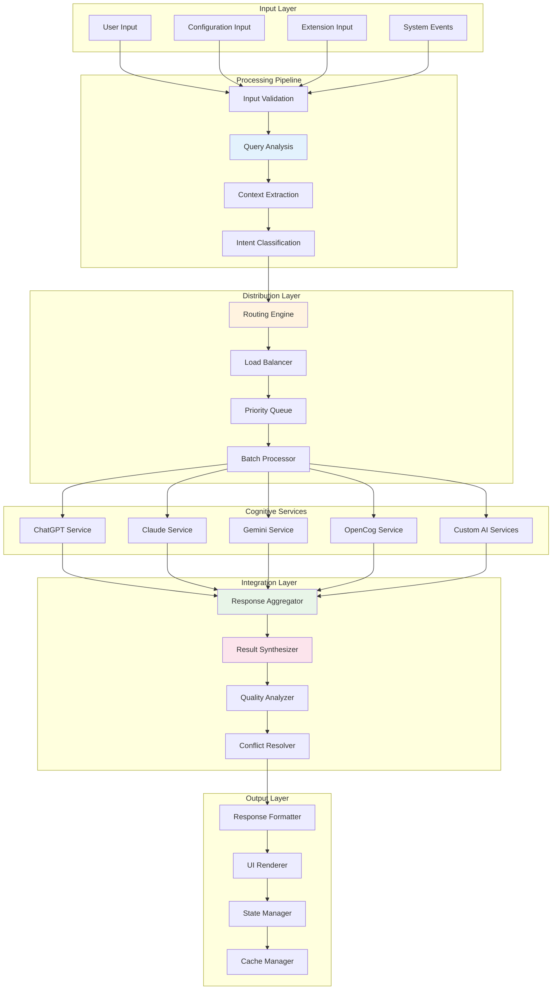
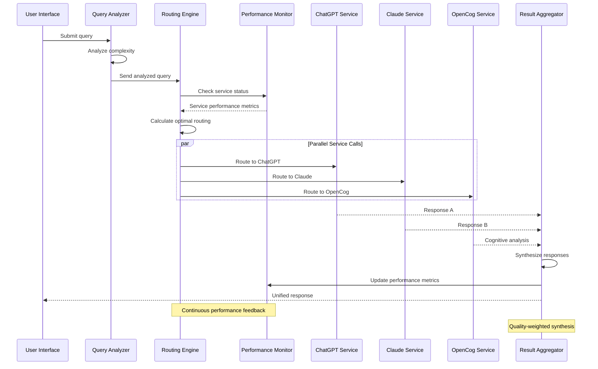
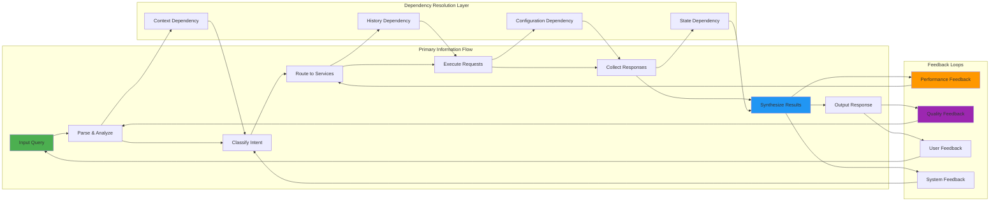
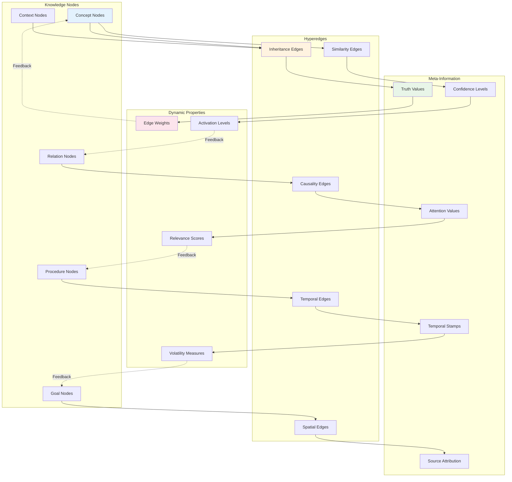
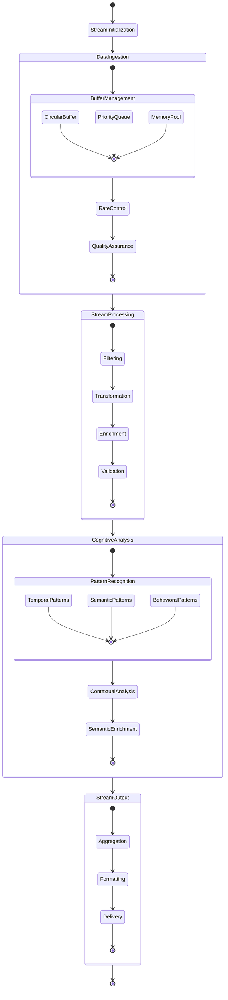
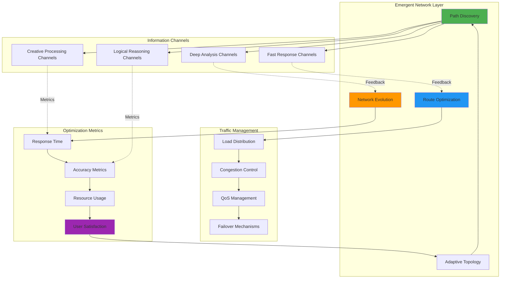
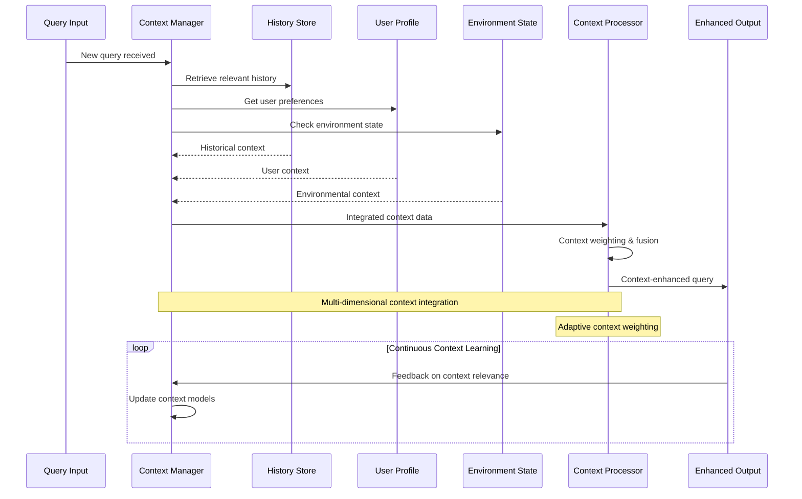
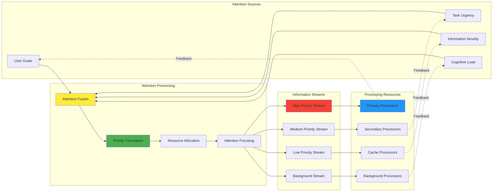

# Data Flow Patterns and Signal Propagation

## Information Flow Architecture Overview

The NoiCog system implements sophisticated **signal propagation pathways** that enable distributed cognitive processing across multiple AI services while maintaining coherent information integration through hypergraph-centric data flow patterns.

## Global Data Flow Architecture

## Signal Propagation Patterns

### **Adaptive Query Routing Architecture**

The system implements intelligent query routing based on cognitive load analysis and service capability matching:

### **Information Cascading and Dependency Resolution**

## Cognitive Data Structures

### **Hypergraph Knowledge Representation**

The system employs hypergraph structures for representing complex relational information across different cognitive domains:

## Stream Processing Architecture

### **Real-time Data Flow Management**

## Emergent Information Pathways

### **Self-Organizing Data Flow Networks**

The system exhibits emergent properties where information pathways adapt and optimize themselves based on usage patterns and cognitive feedback:

## Context-Aware Information Processing

### **Dynamic Context Integration**

## Attention-Driven Information Flow

### **Cognitive Attention Allocation**

The system implements sophisticated attention mechanisms that dynamically prioritize information flow based on cognitive relevance and user goals:

This comprehensive data flow architecture enables the NoiCog system to process, integrate, and synthesize information from multiple cognitive sources while maintaining coherent, context-aware, and adaptively optimized information pathways that exhibit emergent intelligence through sophisticated signal propagation patterns.