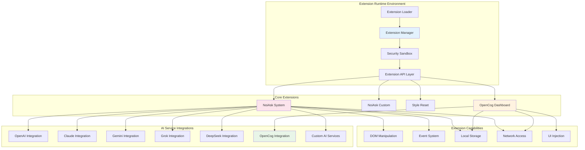
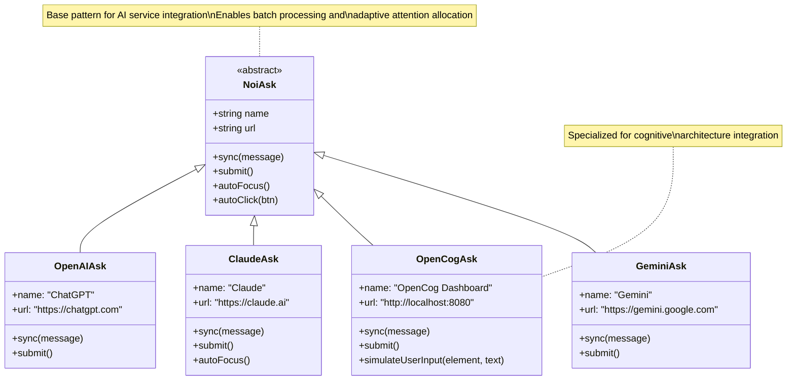
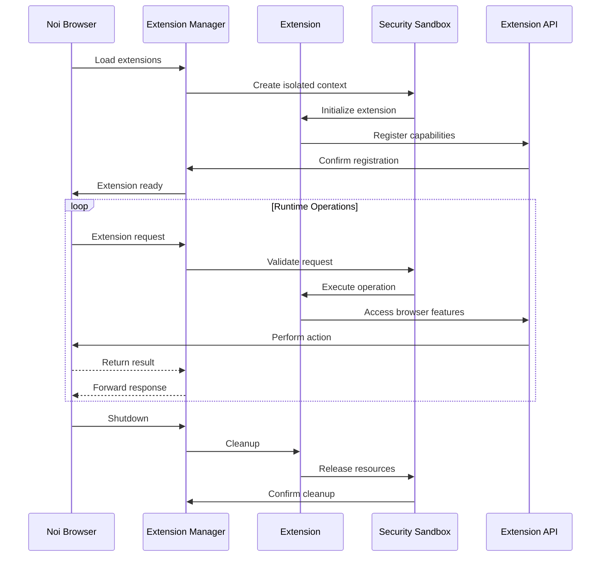
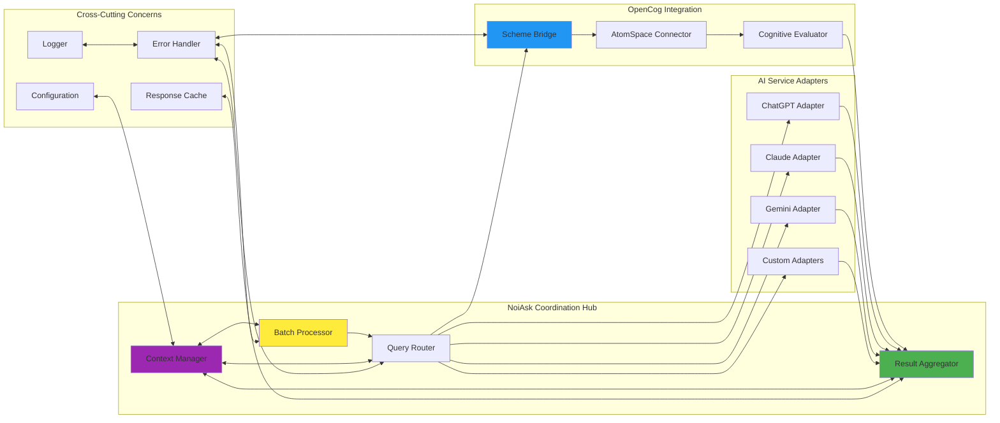
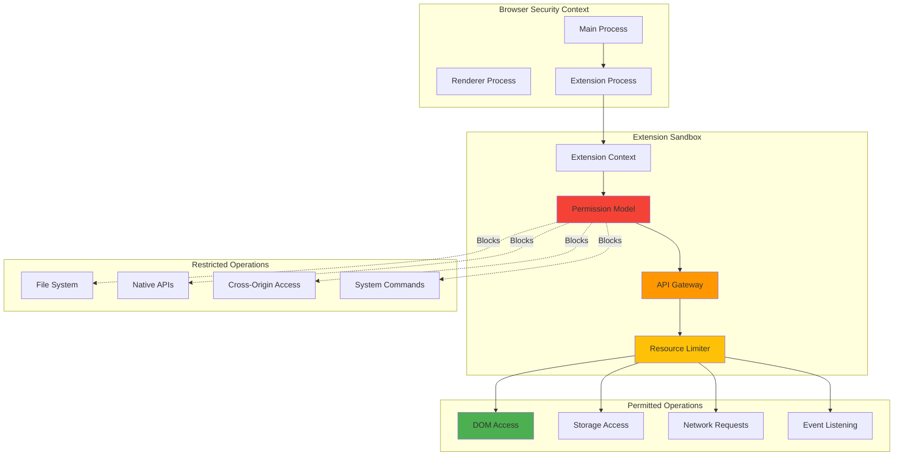
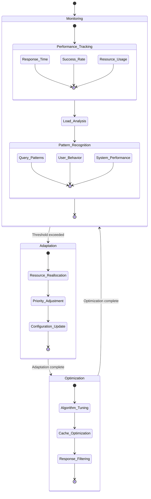
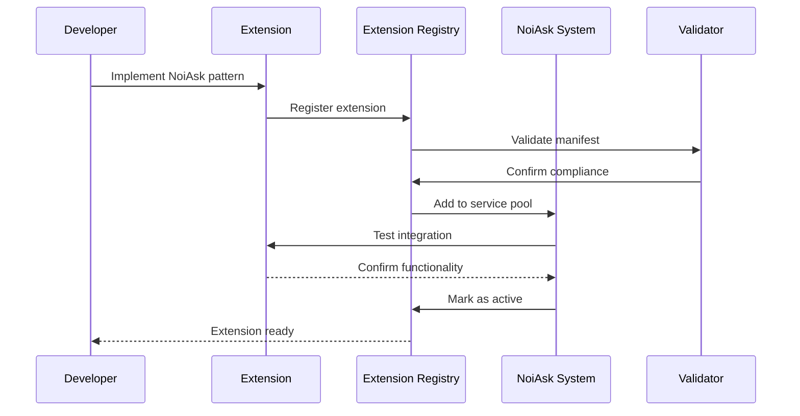

# Extension Architecture

## Extension System Design Principles

The NoiCog extension architecture implements a **hypergraph-centric plugin framework** that enables modular cognitive enhancements while maintaining system coherence and security isolation.

## Extension Ecosystem Overview



## Extension Architecture Patterns

### **NoiAsk Pattern Implementation**

The NoiAsk pattern represents a standardized interface for AI service integration, implementing cognitive synergy optimization through uniform communication protocols.



### **Extension Lifecycle Management**



## Module Interaction Patterns

### **Bidirectional Extension Synergies**

The extension system implements sophisticated inter-module communication enabling emergent cognitive behaviors:



## Extension Security Model

### **Sandbox Architecture**



## Cognitive Extension Patterns

### **Adaptive Attention Allocation in Extensions**

The extension system implements meta-cognitive patterns that enable self-optimizing behavior:



## Extension Development Framework

### **Extension Manifest Structure**

Each extension follows a standardized manifest pattern that enables cognitive integration:

```json
{
  "manifest_version": 3,
  "name": "Extension Name",
  "version": "1.0.0",
  "description": "Cognitive enhancement description",
  "permissions": [
    "activeTab",
    "storage",
    "background"
  ],
  "background": {
    "service_worker": "background.js"
  },
  "content_scripts": [{
    "matches": ["<all_urls>"],
    "js": ["content.js"]
  }],
  "noi_integration": {
    "cognitive_patterns": ["batch_processing", "adaptive_routing"],
    "ai_services": ["openai", "claude", "opencog"],
    "data_flows": ["query_analysis", "result_synthesis"]
  }
}
```

### **Extension Registration Pattern**



This extension architecture enables the emergence of distributed cognitive capabilities, where individual extensions contribute to a collective intelligence that exceeds the capabilities of any single component, implementing true cognitive synergy optimization through adaptive, hypergraph-centric design patterns.