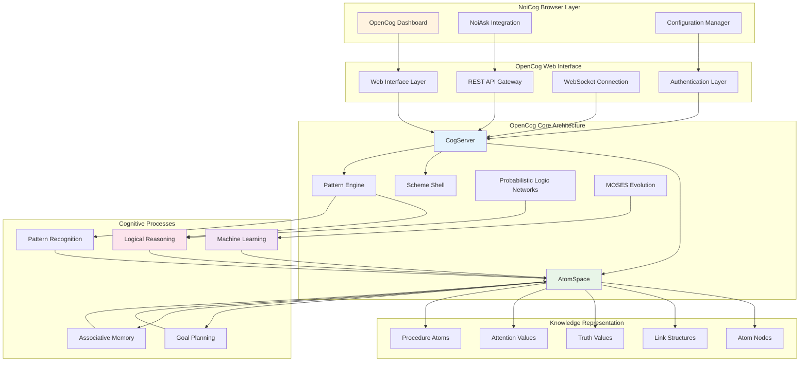
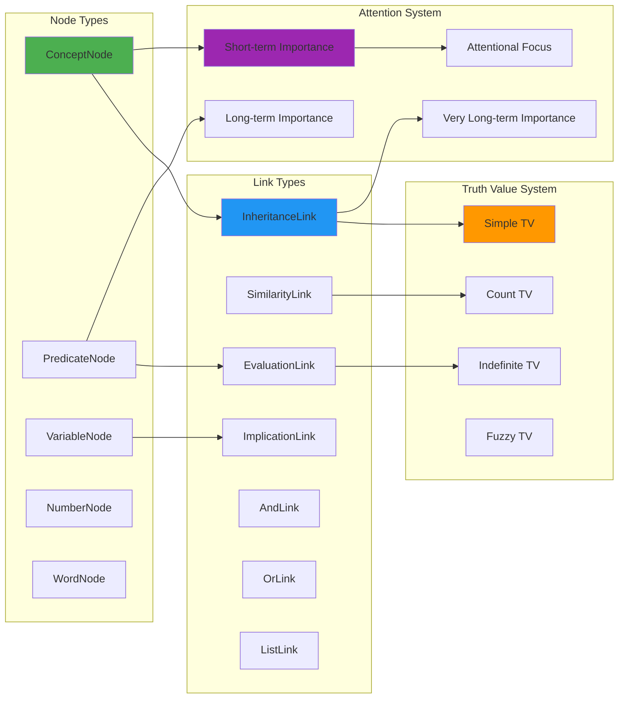
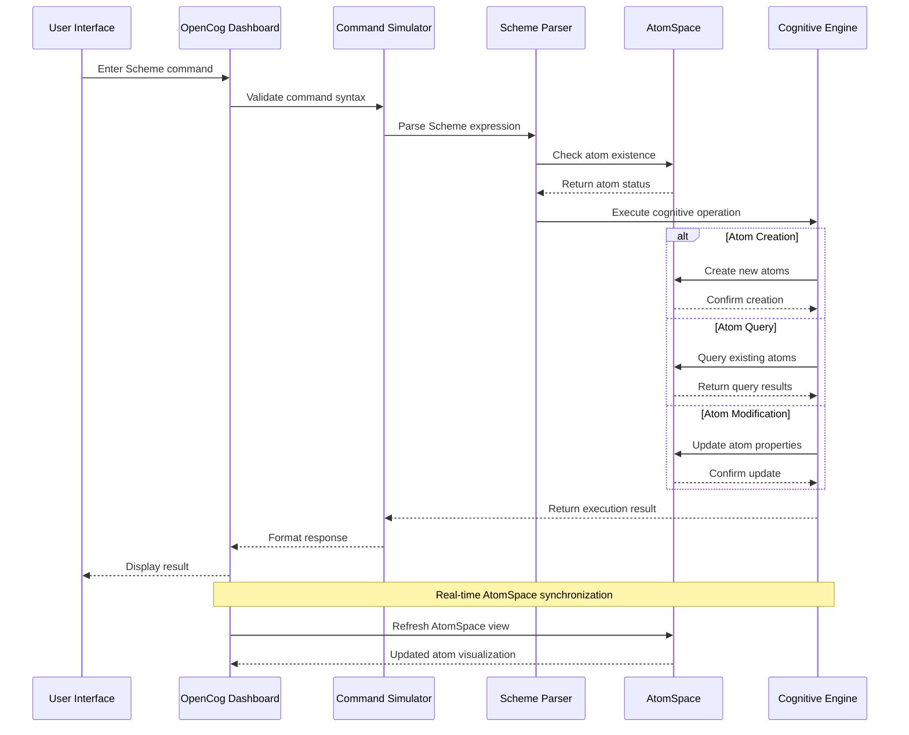
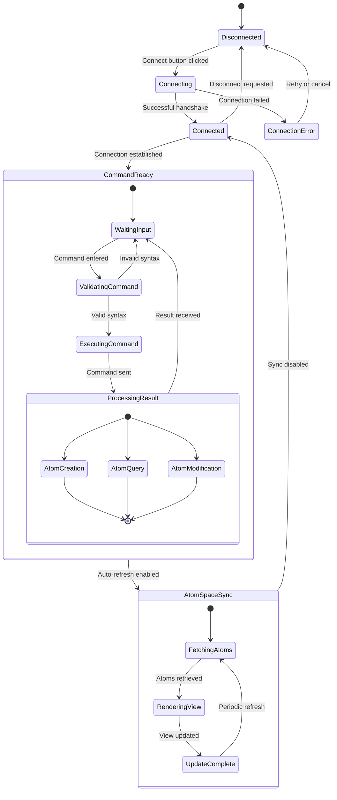
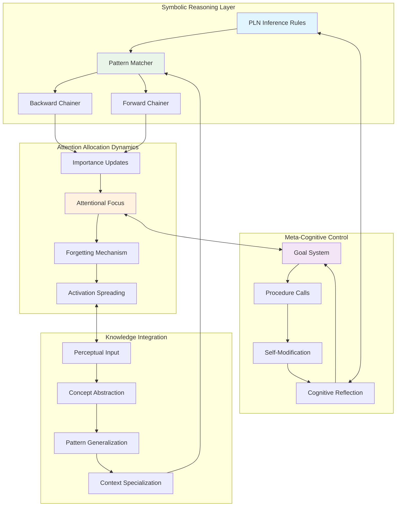
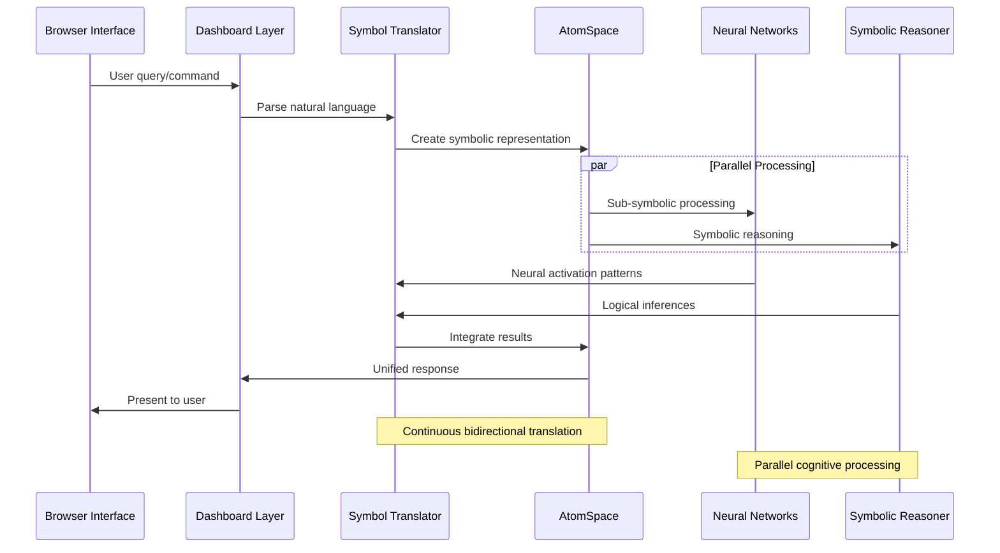
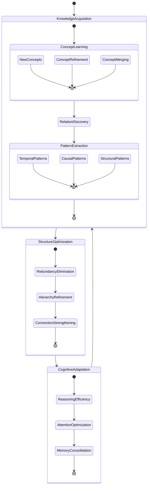

# OpenCog Integration Architecture

## Neural-Symbolic Integration Overview

The OpenCog integration in NoiCog represents a **transcendent neural-symbolic bridge** that enables sophisticated cognitive processing within the browser environment. This integration implements recursive cognitive patterns through the AtomSpace knowledge representation and Scheme-based command execution.

## OpenCog Cognitive Subsystem Architecture

## AtomSpace Knowledge Architecture

### **Hypergraph Structure Implementation**

The AtomSpace implements a hypergraph-based knowledge representation enabling complex relational reasoning:

## OpenCog Dashboard Integration Patterns

### **Scheme Command Execution Pipeline**

### **AtomSpace Visualization and Monitoring**

## Cognitive Processing Patterns

### **Emergent Reasoning Pathways**

The OpenCog integration enables recursive cognitive patterns that emerge from the interaction between symbolic reasoning and neural-like attention dynamics:

## Recursive Implementation Architecture

### **Self-Modifying Cognitive Loops**

```mermaid
graph LR
    subgraph "Cognitive Metacycle"
        Observe[Observe Environment]
        Analyze[Analyze Patterns]
        Hypothesize[Generate Hypotheses]
        Test[Test Predictions]
        Learn[Update Knowledge]
        Adapt[Adapt Behavior]
    end
    
    subgraph "Meta-Learning Layer"
        SelfMonitor[Self-Monitoring]
        StrategyEval[Strategy Evaluation]
        AlgorithmSelect[Algorithm Selection]
        ParameterTune[Parameter Tuning]
    end
    
    subgraph "Recursive Reflection"
        CogState[Cognitive State Analysis]
        PerformanceAssess[Performance Assessment]
        ArchitectureEval[Architecture Evaluation]
        SelfImprove[Self-Improvement]
    end
    
    Observe --> Analyze
    Analyze --> Hypothesize
    Hypothesize --> Test
    Test --> Learn
    Learn --> Adapt
    Adapt --> Observe
    
    Learn --> SelfMonitor
    SelfMonitor --> StrategyEval
    StrategyEval --> AlgorithmSelect
    AlgorithmSelect --> ParameterTune
    ParameterTune --> Analyze
    
    Adapt --> CogState
    CogState --> PerformanceAssess
    PerformanceAssess --> ArchitectureEval
    ArchitectureEval --> SelfImprove
    SelfImprove --> Observe
    
    SelfImprove -.->|Recursive Enhancement| SelfMonitor
    ParameterTune -.->|Meta-Optimization| CogState
    
    style Learn fill:#4caf50
    style SelfMonitor fill:#2196f3
    style SelfImprove fill:#9c27b0
```

## Neural-Symbolic Bridge Mechanisms

### **Bidirectional Translation Protocols**

The integration implements sophisticated translation mechanisms between symbolic and sub-symbolic representations:

## Adaptive Cognitive Optimization

### **Dynamic Knowledge Structure Evolution**

This OpenCog integration architecture enables the emergence of truly intelligent behavior through the synergistic combination of symbolic reasoning, neural processing, and adaptive attention mechanisms, creating a cognitive system that can learn, reason, and evolve its own cognitive architecture in real-time.