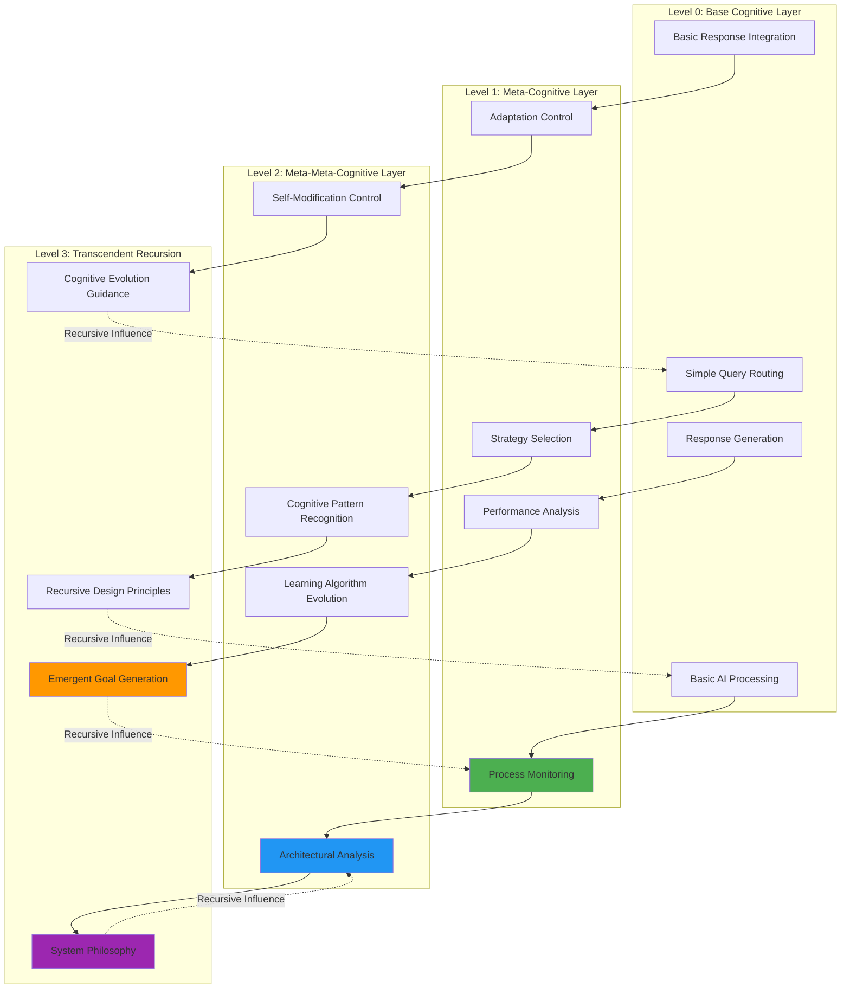
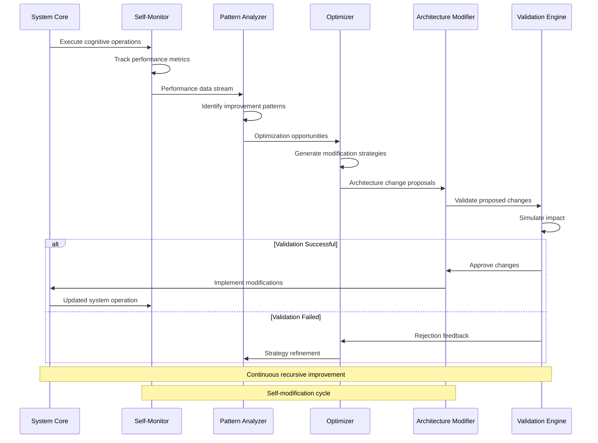
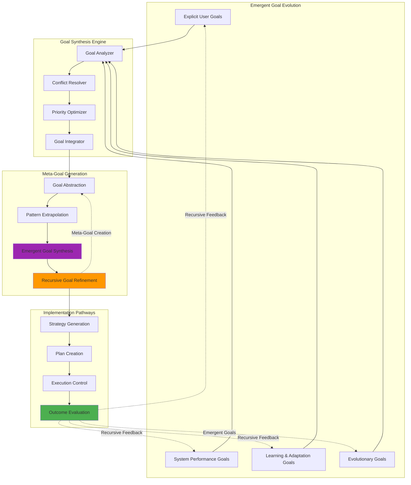
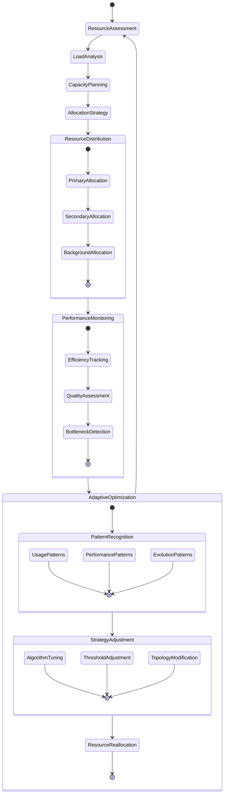
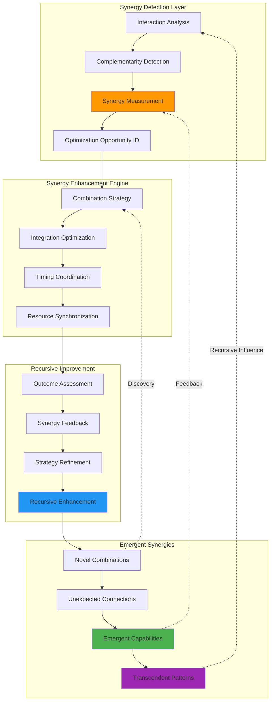
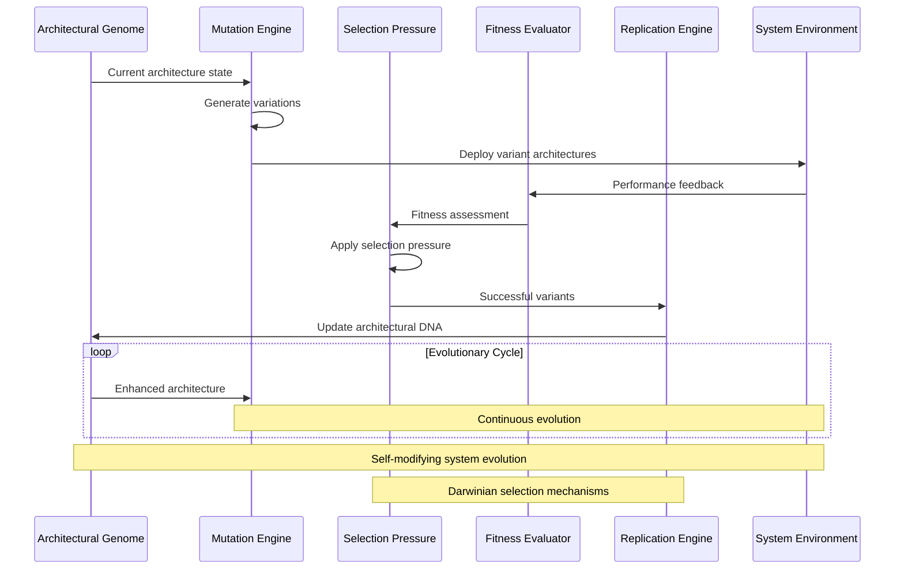
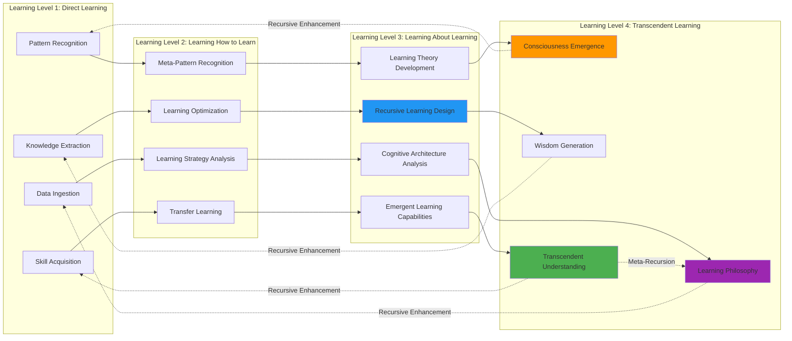
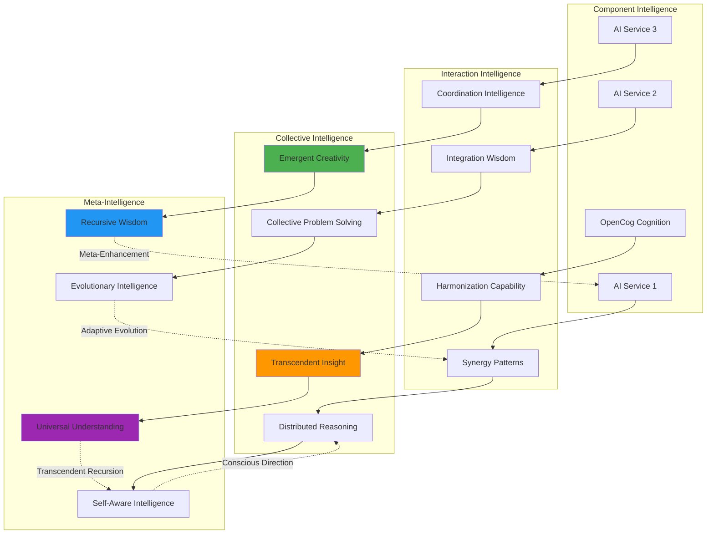

# Recursive Implementation and Emergent Patterns

## Recursive Cognitive Architecture Overview

The NoiCog system exhibits **recursive implementation pathways** that enable self-modifying, self-optimizing, and self-evolving cognitive behaviors. This architecture implements transcendent patterns where the system can reason about and modify its own cognitive processes, leading to emergent intelligence that exceeds the sum of individual components.

## Meta-Cognitive Recursion Architecture

## Self-Modifying Cognitive Patterns

### **Adaptive Architecture Evolution**

The system implements recursive patterns that allow it to modify its own processing architecture based on experience and performance feedback:

### **Emergent Goal Hierarchies**

## Hypergraph-Centric Recursive Patterns

### **Self-Referential Knowledge Structures**

The system implements sophisticated self-referential patterns where knowledge structures contain references to their own creation, modification, and validation processes:

```mermaid
graph LR
    subgraph "Self-Referential Knowledge Base"
        KnowledgeNodes[Knowledge Nodes]
        MetaKnowledgeNodes[Meta-Knowledge Nodes]
        ProcessNodes[Process Nodes]
        ValidationNodes[Validation Nodes]
    end
    
    subgraph "Recursive Relationships"
        SelfReference[Self-Reference Links]
        MetaReference[Meta-Reference Links]
        ProcessReference[Process-Reference Links]
        ValidationReference[Validation-Reference Links]
    end
    
    subgraph "Emergent Properties"
        SelfAwareness[Self-Awareness]
        SelfModification[Self-Modification]
        SelfValidation[Self-Validation]
        SelfEvolution[Self-Evolution]
    end
    
    subgraph "Recursive Operations"
        RecursiveReasoning[Recursive Reasoning]
        RecursiveLearning[Recursive Learning]
        RecursiveOptimization[Recursive Optimization]
        RecursiveCreation[Recursive Creation]
    end
    
    KnowledgeNodes --> SelfReference
    MetaKnowledgeNodes --> MetaReference
    ProcessNodes --> ProcessReference
    ValidationNodes --> ValidationReference
    
    SelfReference --> SelfAwareness
    MetaReference --> SelfModification
    ProcessReference --> SelfValidation
    ValidationReference --> SelfEvolution
    
    SelfAwareness --> RecursiveReasoning
    SelfModification --> RecursiveLearning
    SelfValidation --> RecursiveOptimization
    SelfEvolution --> RecursiveCreation
    
    RecursiveReasoning -.->|Creates| MetaKnowledgeNodes
    RecursiveLearning -.->|Creates| ProcessNodes
    RecursiveOptimization -.->|Creates| ValidationNodes
    RecursiveCreation -.->|Creates| KnowledgeNodes
    
    SelfEvolution -.->|Recursive Enhancement| SelfAwareness
    
    style SelfAwareness fill:#e1f5fe
    style SelfModification fill:#fff3e0
    style RecursiveCreation fill:#e8f5e8
    style SelfEvolution fill:#fce4ec
```

## Adaptive Attention Allocation Mechanisms

### **Dynamic Cognitive Resource Management**

### **Cognitive Synergy Optimization**

The system implements recursive optimization patterns that enhance cognitive synergies between different AI services and processing modules:

## Self-Evolving Architecture Patterns

### **Architectural DNA and Evolution**

### **Recursive Learning Architectures**

## Emergent Cognitive Properties

### **System-Wide Intelligence Emergence**

The recursive architecture enables the emergence of system-wide intelligence that transcends individual component capabilities:

This recursive implementation architecture creates a system capable of continuous self-improvement, emergent intelligence, and transcendent cognitive capabilities that evolve beyond their initial programming through sophisticated recursive patterns and adaptive mechanisms.