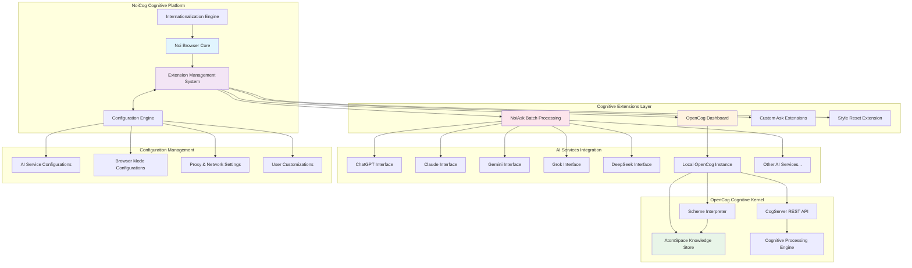
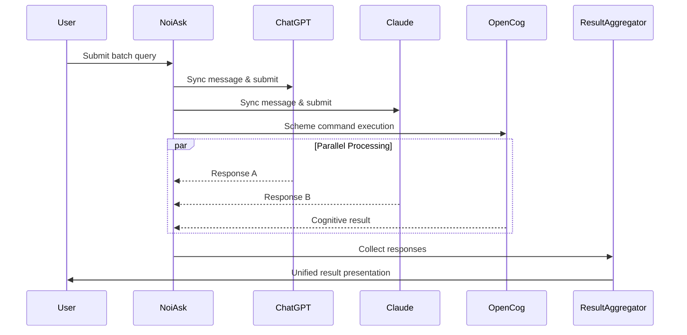
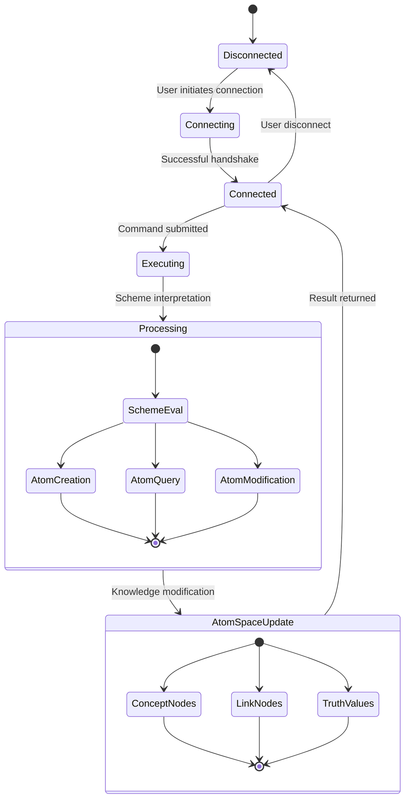
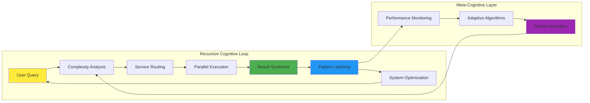

# NoiCog System Overview

## High-Level System Architecture

The NoiCog system represents a cognitive enhancement platform built upon the foundation of an AI-enhanced browser, integrating advanced cognitive architectures through the OpenCog framework with distributed AI service management.

## Principal Architectural Components

### 1. **Noi Browser Core**
The foundational Electron-based browser platform that provides:
- **Customizable Browsing Experience**: URL management and tab-less cache mode
- **Theme Management**: Light/Dark/System/Monochromatic/Frosted texture themes
- **Cookie Data Isolation**: Multi-account support for same-domain services
- **Security Framework**: Isolated browsing contexts and extension sandboxing

### 2. **Extension Management System**
A sophisticated plugin architecture enabling modular functionality:
- **Dynamic Loading**: Runtime extension injection and management
- **API Compatibility**: Limited Chrome extension API support
- **Lifecycle Management**: Extension initialization, activation, and cleanup
- **Cross-Extension Communication**: Event-driven messaging system

### 3. **Cognitive Extensions Layer**

#### NoiAsk Batch Processing System
**Transcendent Technical Precision**: The NoiAsk system implements a hypergraph-centric approach to distributed AI interaction, enabling simultaneous cognitive queries across multiple AI platforms.

#### OpenCog Dashboard Integration
**Neural-Symbolic Integration Point**: Bridges symbolic reasoning capabilities with the browser's cognitive enhancement framework.

### 4. **OpenCog Cognitive Kernel**

The OpenCog integration represents the most sophisticated component, implementing recursive cognitive patterns:

## Emergent Cognitive Patterns

### **Adaptive Attention Allocation Mechanisms**

The system implements dynamic resource allocation based on:
1. **Query Complexity Analysis**: Automatic routing to appropriate AI services
2. **Response Quality Monitoring**: Adaptive learning from service performance
3. **Cognitive Load Balancing**: Distributed processing across available resources
4. **Context-Aware Optimization**: Historical pattern recognition and optimization

### **Recursive Implementation Pathways**

## System Integration Points

### **Configuration Engine Integration**
- **Mode Synchronization**: Dynamic AI service configuration updates
- **Proxy Management**: Network routing and security policies  
- **User Preference Persistence**: Customization state management
- **Multi-language Support**: Localization and internationalization

### **Cross-Component Communication**
The system employs an event-driven architecture enabling:
- **Extension-to-Extension Messaging**: Inter-plugin communication
- **Browser-to-Extension API**: Core platform service access
- **OpenCog-to-Browser Bridge**: Cognitive result integration
- **Configuration-Driven Behavior**: Dynamic system reconfiguration

This architecture enables emergent properties where the whole system exhibits cognitive capabilities greater than the sum of its individual components, creating a truly distributed cognitive enhancement platform.